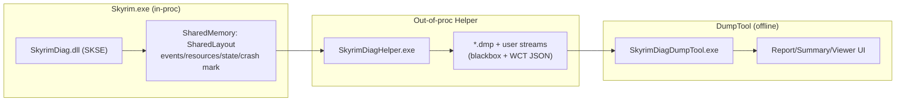

# SkyrimDiag Architecture Review + Refactor Plan

> **Goal:** SkyrimDiag를 “Crash Logger SSE/AE 보다 더 정확/친절”하게 만들기 위해, 현재 아키텍처를 점검하고 디커플링/리팩터링 방향을 정리한다.

## 요구사항 요약

### Functional
- CTD(크래시) / 프리징 / 무한로딩을 자동 감지하고 덤프를 남긴다.
- 덤프를 WinDbg 없이 분석해서, 유저가 이해 가능한 “근거 + 체크리스트”를 제공한다.
- MO2 모드팩 환경에서 “어떤 모드/리소스가 의심되는지” best-effort로 추정한다.
- 성능(끊김/스톨)도 best-effort로 감지해서 단서를 제공한다.

### Non-functional (중요)
- 게임 오버헤드 최소(상시 스택워크/프레임 훅/ETW 같은 무거운 기능 지양)
- 크래시/행 상황에서도 최대한 덤프 생성 성공률 확보
- 설치/사용이 쉬움(MO2에 모드로 설치, overwrite/지정 폴더에 결과)
- 결과가 “확정”이 아닌 경우 신뢰도(높음/중간/낮음)를 명확히 표시
- 확장 가능(새 증거 규칙/리소스 종류/로그 소스 추가)

## 현재 아키텍처(요약)

핵심 결정은 ADR로 기록:
- `docs/adr/0001-out-of-proc-helper-and-shared-memory-blackbox.md`
- `docs/adr/0002-perfhitch-signal-via-heartbeat-lateness.md`

## 아키텍처 판단(현재 설계는 적정한가?)

결론: **“MO2 모드팩 + 일반 유저 UX + 낮은 오버헤드”를 목표로 할 때 현재 구조는 적정합니다.**

특히, “게임 내부에서는 최소 신호만 기록하고, 덤프/분석은 외부에서 수행”하는 구조는:
- 안정성/호환성/오버헤드 측면에서 유리하고
- “유저가 쉽게 쓰는 진단툴”로 성장시키기 좋습니다.

다만 “Crash Logger 수준의 확정적인 원인 모드 특정”은 원천적으로 어렵고, 대신:
- **근거를 많이 모으고(이벤트/리소스/WCT/CrashLogger 로그/스택 스캔)**
- **신뢰도를 정직하게 보여주며**
- **유저가 빠르게 시도할 수 있는 체크리스트를 제공**
하는 방향이 현실적입니다.

## 현재 코드/구조에서 느슨해져야 하는 결합(문제점)

1. DumpTool 분석 로직이 `dump_tool/src/Analyzer.cpp`에 과도하게 집중
   - 덤프 파싱 / MO2 인덱싱 / Crash Logger 파싱 / 증거 규칙 / 보고서 생성이 한 파일에 있음
   - 새 규칙 추가 시 리스크(회귀) 증가, 테스트가 어려움

2. “증거 규칙”이 데이터 수집/파싱 코드와 섞여있어 확장성이 떨어짐
   - 지금은 MVP라 괜찮지만, 규칙이 늘면 유지보수 난이도 급상승

3. 리소스 추적 범위의 한계(현재는 loose file 중심)
   - `.nif/.hkx/.tri`는 유용하지만, BSA/가상 파일 시스템 경유 등은 제한될 수 있음
   - 따라서 리소스 기반 추정은 “단서”로 명확히 표시해야 함

## 리팩터링/디커플링 목표(타겟 구조)

DumpTool을 “core 분석 엔진”과 “UI”로 분리:
- `dump_tool_core` (라이브러리): 덤프 파싱 + 분석 + 보고서/JSON 생성 (UI 의존 X)
- `dump_tool_ui` (EXE): ListView/탭/UI 레이아웃만 담당 (core 호출)

DumpTool 내부 모듈 분리(예시):
- `DumpRead.*` : minidump 스트림/모듈/스택 스캔
- `Mo2Index.*` : MO2 base/mods/overwrite 제공자 매핑
- `CrashLogger.*` : Crash Logger SSE/AE 로그 탐색/파싱
- `EvidenceRules.*` : “증거 규칙” 모음(입력=AnalysisResult, 출력=Evidence/Recommendations/Summary)
- `ReportWriter.*` : `*_SkyrimDiagReport.txt`, `*_SkyrimDiagSummary.json` 생성

## 실행 계획(우선순위)

### Phase 1 (안전/저위험) — 구조 정리
1) DumpTool: `Analyzer.cpp`에서 “증거 생성(BuildEvidenceAndSummary)”을 별도 파일로 분리  
2) DumpTool: MO2 인덱스/CrashLogger 파서를 각각 파일로 분리  
3) DumpTool: 공용 문자열/경로 유틸을 `Util.*`로 정리  

### Phase 2 (품질) — 최소 테스트 도입
4) 덤프 없이도 돌릴 수 있는 단위 테스트 추가(“증거 규칙” 위주)
   - 입력: synthetic `AnalysisResult` + mock resources/events
   - 출력: summary/evidence/recommendations가 기대와 일치하는지

### Phase 3 (정확도) — 근거 소스 확장
5) “리소스 기반 의심 모드”의 신뢰도 개선(시간창/가중치/충돌 우선)
6) Crash Logger 로그 파싱 강화(패턴 다양성 대응)

## 리스크/완화
- 회귀 리스크: 리팩터링은 “기능 변경 없이 파일 분리”부터 시작하고, Windows 빌드로 항상 확인
- 정확도 오해: UI/리포트에서 “확정/추정”과 신뢰도 배지를 강제

